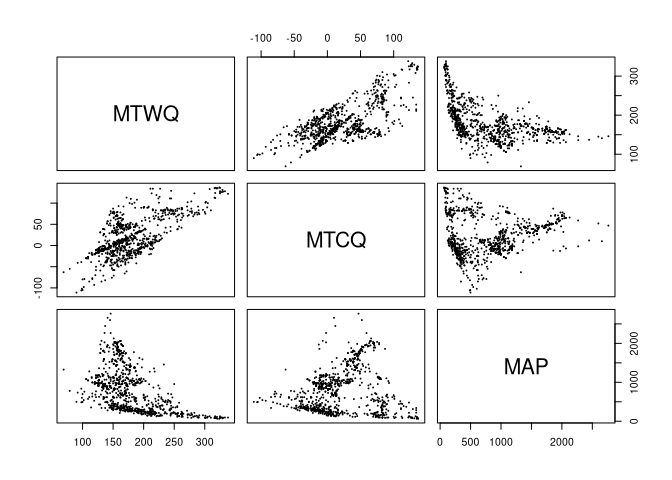
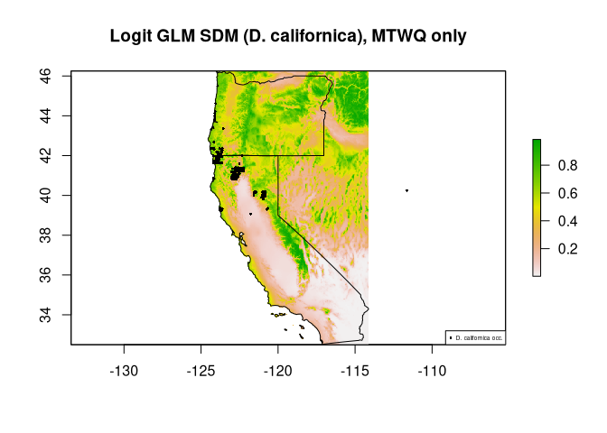
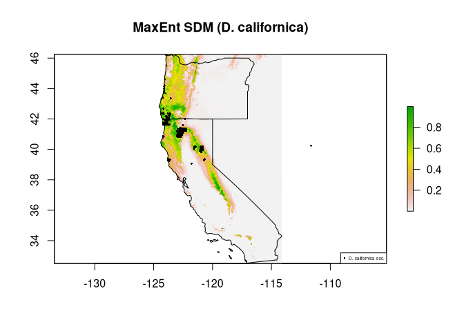
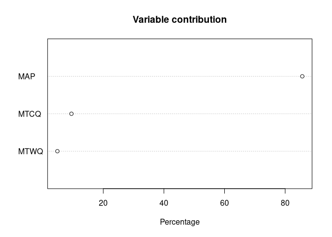
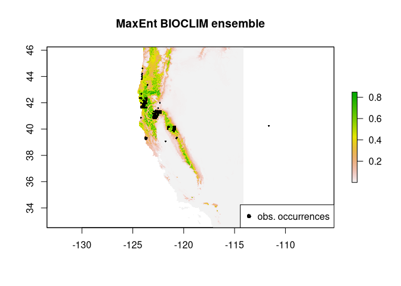
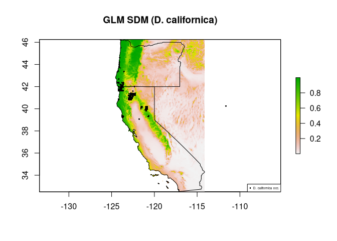
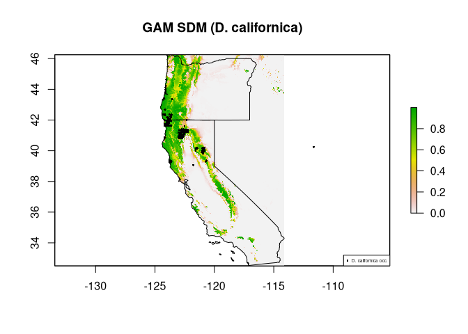
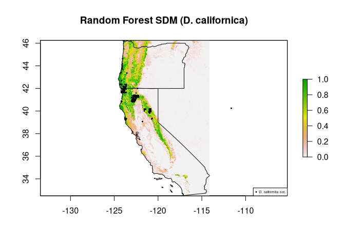
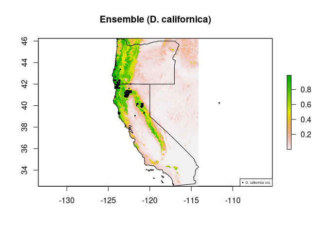

-   [(A) Data Preparation](#a-data-preparation)
    -   [Species occurrence data](#species-occurrence-data)
    -   [Environmental predictor data](#environmental-predictor-data)
    -   [SDM-ready dataframe of predictor values and species
        presence/(pseudo)absence](#sdm-ready-dataframe-of-predictor-values-and-species-presencepseudoabsence)
    -   [Collinearity of predictors](#collinearity-of-predictors)
-   [(B) Manual (base R) SDM](#b-manual-base-r-sdm)
    -   [Linear model](#linear-model)
    -   [Generalized Linear Model SDM](#generalized-linear-model-sdm)
-   [(C) Popular SDM methods in R](#c-popular-sdm-methods-in-r)
    -   [dismo Package](#dismo-package)
    -   [sdm Package](#sdm-package)
-   [(D) Model Evaluation methodologies (coming
    soon!)](#d-model-evaluation-methodologies-coming-soon)

An overview of Species Distribution Modeling in R
=================================================

### This demo was largely based on [Hijmans & Elith, 2013](https://cran.r-project.org/web/packages/dismo/vignettes/sdm.pdf), [Franklin 2010](https://doi.org/10.1017/CBO9780511810602), the Global Change Conservation Lab's [SDM Online Workshop](http://www.earthskysea.org/best-practices-in-species-distribution-modeling-a-workshop-in-r/) and the [sdm](https://cran.r-project.org/web/packages/sdm/sdm.pdf) and [dismo](https://cran.r-project.org/web/packages/dismo/dismo.pdf) documentation pages. The [rspatial.org SDM walkthrough](https://rspatial.org/raster/sdm/1_sdm_introduction.html) is similar to this walkthrough– with more detail but without illustration of some methods like discerning predictor contribution and using the vifstep() function. This document aims to provide a walkthrough of SDM and popular implementations in R as of Fall 2020.

### If you already have an understanding of the motivation of SDM, continue here to learn more about implementation. If you’d like a brief refresher on the motivation and general application of SDM take a look at the powerpoint in this git repository.

### Feel free to download the sdm\_demo.R script, install the necessary packages, and run and manipulate this code as you see fit.

Let’s start by reading in the necessary packages

    # For downloading occurrence data from multiple sources
    library(spocc)
    # For data manipulation and presentation
    library(tidyr)
    library(dplyr)
    library(ggplot2)
    # Provides various functions relating to spatial analysis
    library(maptools)
    library(sp)
    # Reads and manipulates vector data
    library(rgdal)
    # Reads and manipulates raster data
    library(raster)
    # SDM packages
    library(dismo)
    library(sdm)
    library(usdm) # For vifstep function

(A) Data Preparation
====================

Species occurrence data
-----------------------

We’ll use the west coast carnivorous plant, [*Darlingtonia
californica*](https://en.wikipedia.org/wiki/Darlingtonia_californica),
as our species of interest. 

    # Source occurrence data from iNaturalist
    dc <- occ(query = "Darlingtonia californica", from = 'inat')

    ## 2 
    ## 3

    # Could just as easily source from gbif:
    # dc <- occ(query = "Darlingtonia californica", from = 'gbif')

    # Horrible nasty function that makes species occurrence data into lon, lat dataframe
    # This is specific to the format that iNaturalist puts data in
    dc.df <-  as.data.frame(dc$inat$data$Darlingtonia_californica%>%
      dplyr::filter(identifications_most_agree == TRUE) %>%
      dplyr::select(location)) %>% 
      filter(!is.na(location)) %>% 
      separate(location, c("lat", "lon"), ",") %>% 
      select(lon, lat)

    # Lat and Lon columns must be specified as numeric values
    dc.df$lon <- as.numeric(dc.df$lon)
    dc.df$lat <- as.numeric(dc.df$lat)
    head(dc.df)

    ##         lon      lat
    ## 1 -123.9390 41.67295
    ## 2 -124.0979 44.04678
    ## 3 -124.0980 44.04678
    ## 4 -120.9603 39.81911
    ## 5 -120.8786 40.05013
    ## 6 -120.8630 40.07212

    # Let's read some political boundaries in for visualization
    usa.shp <- readOGR("USA", verbose=F)
    CA_OR.shp <- usa.shp[usa.shp@data$NAME %in% c("California", "Oregon"),]

    # Let's take a look at our raw occurrence points
    sp::plot(CA_OR.shp, main = "Darlingtonia californica (iNaturalist)")
    points(dc.df$lon, dc.df$lat)

<!-- -->

Environmental predictor data
----------------------------

    # Download bioclimatic variables from worldclim
    # run ??getData to see other options for climate data
    bioclim_global.stack <- raster::getData(name = "worldclim",
                            var = 'bio', 
                            res = 2.5)

    # This replaces bioX name with more descriptive acronym
    # We choose 4 climatic variables here more for exemplary purposes than biologically
    # sound reasoning, but all predictors chosen should be motivated/informed
    # by biological knowledge
    names(bioclim_global.stack)[names(bioclim_global.stack) %in% c("bio1", "bio10", "bio11", "bio12")] <- 
      c("MAT", "MTWQ", "MTCQ", "MAP")
    # bio1 = Mean Annual Temperature (MAT)
    # bio10 = Mean Temperature of Warmest Quarter (MTWQ)
    # bio11 = Mean Temperature of Coldest Quarter (MTCQ)
    # bio12 = Annual Precipitation (MAP)
    # etc.

    # This crops the extent to Oregon and California
    bioclim.stack <- crop(bioclim_global.stack, extent(CA_OR.shp))

    # Let's only look at these 4 variables
    predictors <- raster::subset(bioclim.stack, c("MAT", "MTWQ", "MTCQ", "MAP"))

    # Let's see what Mean Annual temperature raster looks like
    sp::plot(predictors$MAT, main = "Mean Annual Temperature")

<!-- -->

SDM-ready dataframe of predictor values and species presence/(pseudo)absence
----------------------------------------------------------------------------

    # These are the predictor values at locations of species presence
    presvals <- raster::extract(predictors, dc.df)

    # These are 500 random locations, used as in place of absence values as 
    # 'pseudoabsences' (the species probably doesn't occur at any random point)
    # True 'absences' are better, but folks don't often record all the places where 
    # they don't find species
    backgr <- randomPoints(predictors, 500)

    # predictor values at random locations
    absvals <- raster::extract(predictors, backgr)

    # We know that probability of presence is 1 for areas where the species
    # was found, and we assume it's 0 for the random background points
    Y <- c(rep(1, nrow(presvals)), rep(0, nrow(absvals)))

    # Now here we have a dataframe with the response variable (Y) and corresponding
    # predictor values
    sdmdata <- data.frame(cbind(Y, rbind(presvals, absvals)))
    head(sdmdata)

    ##   Y MAT MTWQ MTCQ  MAP
    ## 1 1 102  158   52 1833
    ## 2 1 111  156   70 2003
    ## 3 1 111  156   70 2003
    ## 4 1  88  170   16 1213
    ## 5 1  75  160   -2  956
    ## 6 1  86  172    6  915

Collinearity of predictors
--------------------------

Collinearity can cause problems in Species Distribution Models. My
understanding is that if two or more predictors are collinear across the
environmental space, then it’s difficult to determine which predictor is
actually influencing the distribution of the species (if not both). If
the predictors are not collinear in the areas to which the SDM is
projected then the model won’t know how to assign probability of habitat
suitability to the independent predictors

    # We can check for collinearity by visually inspecting a scatterplot matrix
    pairs(sdmdata[,2:length(sdmdata)], cex = 0.1, fig=TRUE)

<!-- -->

    # MAT and MTWQ appear to be collinear across this area!
    # There are more quantitative assessments of collinearity (like using the Variance Inlation Factor)
    # vifstep() from the usdm package uses VIF to identify the most collinear predictors
    # From the vifstep() documentation:
    # "vifstep calculate VIF for all variables, exclude one with highest VIF (greater than threshold), 
    #repeat the procedure until no variables with VIF greater than th remains."
    vifstep(select(sdmdata, -Y), th=10)

    ## 1 variables from the 4 input variables have collinearity problem: 
    ##  
    ## MAT 
    ## 
    ## After excluding the collinear variables, the linear correlation coefficients ranges between: 
    ## min correlation ( MAP ~ MTCQ ):  0.2614087 
    ## max correlation ( MTCQ ~ MTWQ ):  0.5846712 
    ## 
    ## ---------- VIFs of the remained variables -------- 
    ##   Variables      VIF
    ## 1      MTWQ 5.191653
    ## 2      MTCQ 4.147142
    ## 3       MAP 3.667557

    # It appears that when MAT is removed. There aren't significant collinearity 
    # problems among the predictors

    # So let's remove MAT and try again
    predictors <- raster::subset(bioclim.stack, c("MTWQ", "MTCQ", "MAP"))
    presvals <- raster::extract(predictors, dc.df)
    backgr <- randomPoints(predictors, 500)
    absvals <- raster::extract(predictors, backgr)
    Y <- c(rep(1, nrow(presvals)), rep(0, nrow(absvals)))
    sdmdata <- data.frame(cbind(Y, rbind(presvals, absvals)))

    pairs(sdmdata[,2:length(sdmdata)], cex = 0.1, fig=TRUE)

<!-- -->

    # Better! 

(B) Manual (base R) SDM
=======================

Let’s do some SDMs using linear models and Generalized Linear Models–
these are very rudimentary and not used in published papers, but I think
these examples are important for understanding how some of the simplest
SDMs (under the family of regression methods) generally work

Let’s start Modeling! Here’s the most basic regression SDM, a linear
model

Linear model
------------

*E**Y* = *m* \* *x* + *b* + *e*

*E**Y* = expected habitat suitability

*b* = intercept

*m* = coefficient

*x* = predictor

*e* = error

Assumes: Normal distributed error mean = 0 Variance(*E**Y*)
is constant

    sdm_lm <- lm(Y ~ MTWQ, data = sdmdata)
    plot(sdmdata$MTWQ, sdmdata$Y, 
         main = "D. californica Linear SDM",
         xlab = "Mean Temp of Warmest Quarter",
         ylab = "Presence/Absence"
         )
    abline(sdm_lm)

<!-- --> The simplest
SDM ever! As Mean Temperature of the Warmest Quarter increases, the more
absent the species is. This relationship can be mapped out in geographic
space, but would not be too informative because the model fit is poor
and we know that other climatic variables impact species distributions.

Generalized Linear Model SDM
----------------------------

*g*(*E**Y*) = *L* = *m* \* *x* + *b* + *e*

*g*() is link function

*L* = Linear Predictor

GLMs Do not have to have: \* normal distribution of error \* homogenous
variance Different link functions can be used, which each have their own
assumptions. A GLM with a Gaussian link function is simply a Linear
Model– it carries the same assumptions as a linear model. We can make
the same linear model as above using the glm() function

    plot(sdmdata$MTWQ, sdmdata$Y, 
         main = "D. californica Gaussian GLM SDM",
         xlab = "Mean Temp of Warmest Quarter",
         ylab = "Presence/Absence"
    )

    sdm_lm <- glm(Y ~ MTWQ, data = sdmdata, family = gaussian)
    abline(sdm_lm, lwd = 3, col = "blue")

<!-- -->

The Gaussian link function doesn’t make too much sense for SDM because
SDM has a binary response variable: presence or absence. When trying to
interpret the above model we run into a problem– At MTWQ = 20.0°C, what
does .4 Presence/Absence mean? How can we have a plant .4 present at a
location? This does not make sense, and we must transform our model to
provide the *probability* of presence (arguably better interpreted as
“habitat suitability”) as the response variable. This would give meaning
to values between 1 and 0. We can do this with the logit link function.

*g*(*E**Y*) = *L* = *m* \* *x* + *b* + *e*

*L* = *l**o**g*10(*E**Y*/(1 − *E**Y*))

solve for *E**Y*

Expanded Logit GLM:
*E**Y* = *e**m* \* *x* + *b* + *e*/(1 + *e**m* \* *x* + *b* + *e*)

    sdm_glm <- glm(Y ~ MTWQ, data = sdmdata, family = binomial)
    # This is the expanded logit GLM equation, written as an R function
    Ey_calc <- function(x){
      y_int <- as.numeric(sdm_glm$coefficients["(Intercept)"])
      m <- as.numeric(sdm_glm$coefficients["MTWQ"])
      LP = m*x + y_int
      return(exp(LP) / (1 + exp(LP)))
    }

    MTWQ_sorted <- sort(sdmdata$MTWQ)
    Ey <- Ey_calc(MTWQ_sorted)

    plot(sdmdata$MTWQ, sdmdata$Y, 
         main = "D. californica Logit GLM SDM",
         xlab = "Mean Temp of Warmest Quarter",
         ylab = "Probability of Presence"
    )

    lines(MTWQ_sorted, Ey, lwd = 3, col = "red")

<!-- -->

Now let’s project this onto geographic space, taking known values of the
environment from raster files and using our GLM to predict the
‘probability of presence’ in each raster cell

    # Here's a function we'll use to plot SDM projections
    project.sdm <- function(prediction, plotName){
      sp::plot(prediction, main = plotName)
      sp::plot(CA_OR.shp, add = T)
      points(dc.df, pch = 16, cex = .4)
      legend("bottomright", legend = "D. californica occ.", pch = 16, cex=.4)
    }

    # Here's a map of projection of the Logit GLM SDM model. We can use the raster 
    # 'predict()' function to produce a raster layer of the predicted values
    prediction_glm <- raster::predict(bioclim.stack, sdm_glm)

    project.sdm(prediction_glm, "Logit GLM SDM (D. californica), MTWQ only")

<!-- -->

Notice how the raster legend shows values between -6 and 4. These aren’t
probabilities! This happened because we’re plotting the logit
transformed response variable
*g*(*E**Y*) = *m* \* *x* + *b* + *e* where
*g*(*E**Y*) = *l**o**g*10(*E**Y*/(1 − *E**Y*))
Solve for *E**Y* to get the probability value between 0 and
1:
*E**Y* = *e**g*(*E**Y*)/(1 + *e**g*(*E**Y*))

    prediction_glm.Ey <- exp(prediction_glm) / (1 + exp(prediction_glm))
    project.sdm(prediction_glm.Ey, "Logit GLM SDM (D. californica), MTWQ only")

<!-- -->

Looks like a real SDM! Although you can see that the model predicts high
habitat suitability in areas where *D. californica* wasn’t actually
observed. Maybe if we throw the other climatic predictors in it will
help.

    sdm_glm2 <- glm(Y ~ MTWQ + MTCQ + MAP, data = sdmdata, family = binomial)
    prediction_glm2 <- raster::predict(bioclim.stack, sdm_glm2)
    prediction_glm2.Ey <- exp(prediction_glm2) / (1+exp(prediction_glm2))
    project.sdm(prediction_glm2.Ey, "GLM SDM (D. californica)")

<!-- -->

Notice how the area where the model predicts high habitat suitability
where there weren’t actual occurrences is much lower. We can still do
better! Let’s begin looking at some of the SDM packages and functions
that are popular in R.

(C) Popular SDM methods in R
============================

There are 3 general classes of SDM methods:

1.  **Profiling Methods**: distance and environmental envelope based
    methods. Includes BIOCLIM, DOMAIN, and Mahalanobis.
2.  **Regression Methods**: uses regression-based methods to model the
    relationship between predictors and occurences. Includes GLM, GAM,
    and MARS
3.  **Machine Learning Methods**: Includes Artificial Neural Networks,
    Boosted Regression Trees, Random Forest, and Support Vector Machines

Instead of organizing this section by these different algorithms, as
rspatial.org does, I will structure this based on some of the most
popular SDM R packages: **sdm** and **dismo**

dismo Package
-------------

I think that **dismo** is the most popular SDM package after querying
the number of package downloads using the
[dlstats](https://cran.r-project.org/web/packages/dlstats/vignettes/dlstats.html)
package SDM algorithms included within the **dismo** package include:
BIOCLIM, DOMAIN, MaxEnt. Note that these are all presence-only
algorithms Also included in the package are functions to

-   evaluate model fit
-   test the importance of particular variables
-   produce bioclim variables from monthly climate data (like CMIP5)
-   calculate niche equivalency, niche overlap
-   find the best predicted presence/absence threshold based on chosen
    accuracy metrics

<!-- -->

    # BIOCLIM
    # One of the oldest models, and a profiling method.
    # It puts a convex hull around all the points in n-dimensional niche space
    # Not very powerful at extrapolation
    # Input = predictor values at locations where the species is present
    sdm_bioclim <- bioclim(presvals)
    # Look at the relationship between predicted value and each predictor
    response(sdm_bioclim)

<!-- -->

    prediction_bioclim <- dismo::predict(sdm_bioclim, bioclim.stack)
    project.sdm(prediction_bioclim, "BIOCLIM SDM (D. californica)")

<!-- -->

    # MaxEnt
    # The most popular SDM method, uses the machine learning algorithm maximum entropy.
    # Need to install maxent (https://biodiversityinformatics.amnh.org/open_source/maxent/)
    # and place it here:
    system.file("java", package="dismo")

    ## [1] "/home/avery/.R/library/dismo/java"

    # Input = rasterstack or brick of predictors and the lon/lat of species occurrences
    sdm_maxent <- maxent(predictors, dc.df)
    prediction_maxent <- dismo::predict(sdm_maxent, bioclim.stack)
    project.sdm(prediction_maxent, "MaxEnt SDM (D. californica)")

<!-- -->

    # Look at response for each predictor
    response(sdm_maxent)

<!-- -->

    # Look at variable contribution for maxent
    sp::plot(sdm_maxent)

<!-- -->

    # Make an ensemble model! Many researchers end up averaging the results of different
    # models and then, if the model accuracy is better, using the average as 
    # an ensemble model
    ensemble_bioclim.maxent <- mean(prediction_bioclim, prediction_maxent)
    sp::plot(ensemble_bioclim.maxent, main = "MaxEnt BIOCLIM ensemble")
    points(dc.df, pch = 16, cex = .4)
    legend("bottomright", legend = "obs. occurrences", pch = 16)

<!-- -->

sdm Package
-----------

It seems to me that **sdm** can implement all algorithms that **dismo**
can, plus many more SDM algorithms included within the **sdm** package
(after running the function installAll()) include: GLM, GAM, Gradient
Boosting, Random Forest, MARS, Support Vector Machines, MaxEnt,
Mahalanobis distance, DOMAIN, BIOCLIM, Maximum Likelihood You can use
getmethodNames() to see all possible methods

    # First we need to prep the data in a particular way to be compatible with sdm functions
    sdm.pkg.df_pres <- cbind(dc.df, presvals)
    sdm.pkg.df_pres$Y <- 1
    names(sdm.pkg.df_pres)[1:2] <- c("x", "y")
    sdm.pkg.df_abs <- data.frame(cbind(backgr, absvals))
    sdm.pkg.df_abs$Y <- 0
    sdmdf_sdmpkg <- rbind(sdm.pkg.df_pres, sdm.pkg.df_abs)
    sdmdata_sdmpkg <- sdmData(Y ~ MTWQ + MTCQ + MAP, train = sdmdf_sdmpkg)

    # Run a GLM model using the sdm package
    sdm_ml.glm <- sdm::sdm(Y ~ MTWQ + MTCQ + MAP, data = sdmdata_sdmpkg, methods=c("glm"))
    prediction_ml.glm <- raster::predict(sdm_ml.glm, bioclim.stack)
    project.sdm(prediction_ml.glm, "GLM SDM (D. californica)")

<!-- -->

    # Use this function to determine which variables were more important
    getVarImp(sdm_ml.glm)

    ## 
    ## The values of relative variable importance are generated from 1 models...

    ## Relative Variable Importance 
    ## ============================================================= 
    ## method              : Permutation based on two metrics (Pearson Correlation and AUC)
    ## number of variables :  3 
    ## variable names      :  MTWQ, MTCQ, MAP 
    ## ============================================================= 
    ## Relative variable importance 
    ## ---------------------------------------------- 
    ## Based on Correlation metric: 
    ## ---------------------------------------------- 
    ## MTWQ                : ************** (27.7 %) 
    ## MTCQ                : *** (5.3 %) 
    ## MAP                 : **************************** (56.5 %) 
    ## ============================================================= 
    ## Based on AUC metric: 
    ## ---------------------------------------------- 
    ## MTWQ                : *********** (22.4 %) 
    ## MTCQ                : ** (4.3 %) 
    ## MAP                 : ********************** (43.8 %) 
    ## =============================================================

    # Let's try GAM, a regression method
    # Run the model and project
    sdm_ml.gam <- sdm::sdm(Y ~ MTWQ + MTCQ + MAP, data = sdmdata_sdmpkg, methods=c("gam"))
    prediction_ml.gam <- raster::predict(sdm_ml.gam, bioclim.stack)
    project.sdm(prediction_ml.gam, "GAM SDM (D. californica)")

<!-- -->

    getVarImp(sdm_ml.gam)

    ## 
    ## The values of relative variable importance are generated from 1 models...

    ## Relative Variable Importance 
    ## ============================================================= 
    ## method              : Permutation based on two metrics (Pearson Correlation and AUC)
    ## number of variables :  3 
    ## variable names      :  MTWQ, MTCQ, MAP 
    ## ============================================================= 
    ## Relative variable importance 
    ## ---------------------------------------------- 
    ## Based on Correlation metric: 
    ## ---------------------------------------------- 
    ## MTWQ                : ****************** (35.5 %) 
    ## MTCQ                : ******************* (38.3 %) 
    ## MAP                 : ****************** (36.7 %) 
    ## ============================================================= 
    ## Based on AUC metric: 
    ## ---------------------------------------------- 
    ## MTWQ                : **************** (31.5 %) 
    ## MTCQ                : ******************* (37.2 %) 
    ## MAP                 : ********** (20.3 %) 
    ## =============================================================

    # Let's try Random Forest, which is a machine learning method
    # Run the model and project
    sdm_rf <- sdm::sdm(Y ~ MTWQ + MTCQ + MAP, data = sdmdata_sdmpkg, methods=c("rf"))
    prediction_rf <- raster::predict(sdm_rf, bioclim.stack)
    project.sdm(prediction_rf, "Random Forest SDM (D. californica)")

<!-- -->

    getVarImp(sdm_rf)

    ## 
    ## The values of relative variable importance are generated from 1 models...

    ## Relative Variable Importance 
    ## ============================================================= 
    ## method              : Permutation based on two metrics (Pearson Correlation and AUC)
    ## number of variables :  3 
    ## variable names      :  MTWQ, MTCQ, MAP 
    ## ============================================================= 
    ## Relative variable importance 
    ## ---------------------------------------------- 
    ## Based on Correlation metric: 
    ## ---------------------------------------------- 
    ## MTWQ                : *********** (21.8 %) 
    ## MTCQ                : ********** (20.5 %) 
    ## MAP                 : ************************** (51.2 %) 
    ## ============================================================= 
    ## Based on AUC metric: 
    ## ---------------------------------------------- 
    ## MTWQ                : ****** (12.3 %) 
    ## MTCQ                : ****** (12 %) 
    ## MAP                 : ********************** (43.8 %) 
    ## =============================================================

    # ENSEMBLE let's make an ensemble model of all of them
    # a number of methods can be used, see documentation, but they include 
    # weighted mean, unweighted mean, median, entropy, etc
    sdm_glm.gam.rf <- sdm::sdm(Y ~ MTWQ + MTCQ + MAP, data = sdmdata_sdmpkg, methods=c("glm","gam","rf"))
    sdm_ensemble <- sdm::ensemble(sdm_glm.gam.rf, bioclim.stack, 
                                  setting=list(method="weighted", stat="TSS"))
    project.sdm(sdm_ensemble, "Ensemble (D. californica)")

<!-- -->

    getVarImp(sdm_glm.gam.rf)

    ## 
    ## The variable importance for all the models are combined (averaged)...

    ## Relative Variable Importance List 
    ## ============================================================= 
    ## method              : Permutation based on two metrics (Pearson Correlation and AUC)
    ## number of variables :  3 
    ## variable names      :  MTWQ, MTCQ, MAP 
    ## number of models    :  3 
    ## ============================================================= 
    ## Summary of relative variable importance 
    ## ---------------------------------------------- 
    ## Based on Correlation metric: 
    ## ---------------------------------------------- 
    ## MTWQ                : *********[****---] (28 %) 
    ## MTCQ                : [**********--------] (21.2 %) 
    ## MAP                 : *****************[******-----] (48.1 %) 
    ## ============================================================= 
    ## Based on AUC metric: 
    ## ---------------------------------------------- 
    ## MTWQ                : ****[******----] (21.8 %) 
    ## MTCQ               [: *********--------] (17.5 %) 
    ## MAP                 : *********[********-------] (35.8 %) 
    ## =============================================================

(D) Model Evaluation methodologies (coming soon!)
=================================================
